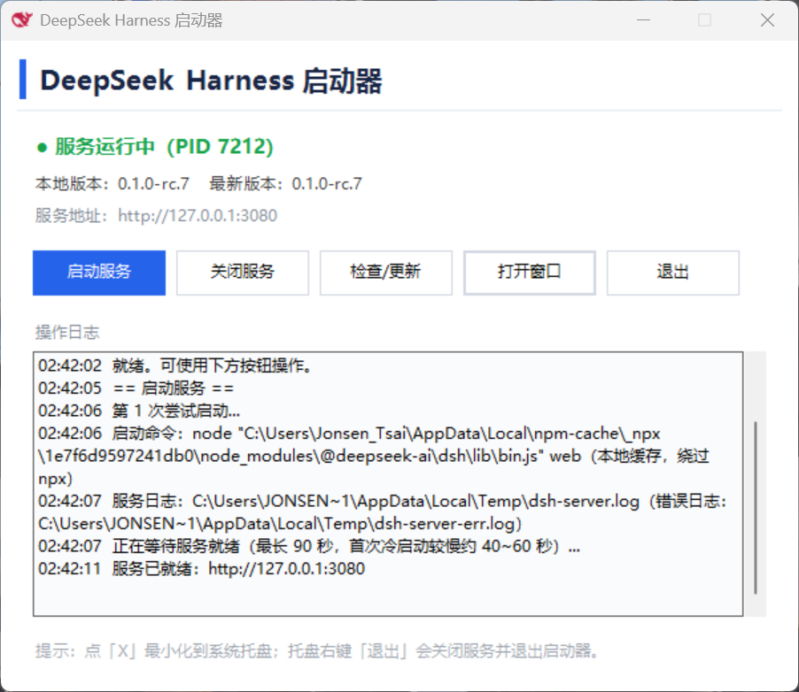
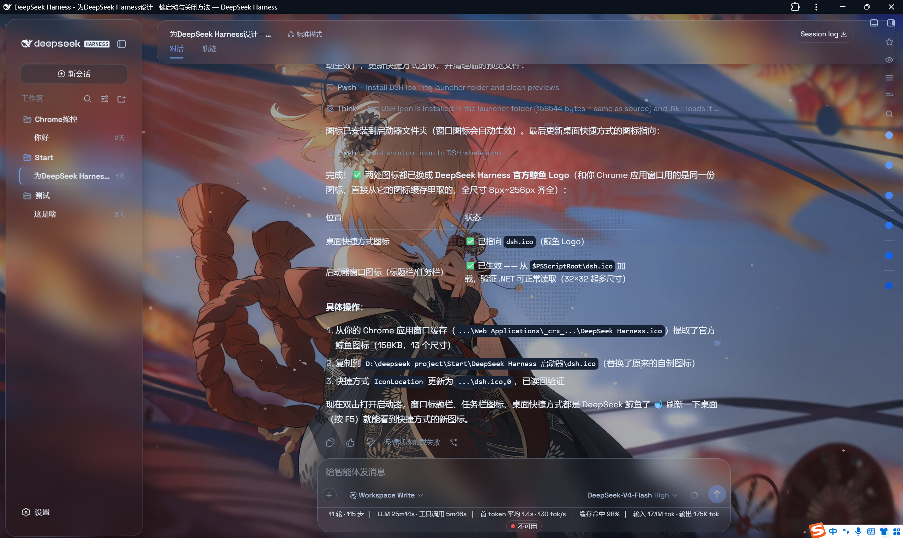

# DeepSeek Harness 一键启动器 (dsh-launcher)
作者：[JonsenTsai]、主页：https://github.com/JonsenTsai

> 在 Windows 上以图形界面一键启动 / 关闭 / 更新 [DeepSeek Harness](https://www.npmjs.com/package/@deepseek-ai/dsh)（dsh），支持系统托盘常驻。

## 功能

- **一键启动**：后台启动 dsh 服务（默认端口 3080），就绪后自动打开应用窗口
- **一键关闭**：按端口 + 进程命令行特征安全清理整棵服务进程树
- **检查 / 更新**：对比本地版本与 npm 最新版本，一键升级
- **系统托盘常驻**：启动即在托盘显示图标；左键单击托盘图标显示窗口；右键菜单「退出」（退出时一并关闭服务）
- **自动清理残留**：启动前清理残留 dsh 进程，避免 cordis.yml 写锁（EPERM）
- **网络兼容**：优先使用本地 npx 缓存直接启动，npm 查询失败时直连 registry

## 界面预览




## 环境要求

- Windows 10 / 11
- PowerShell 5.1+（系统自带即可）
- Node.js（含 npm / npx）
- 可选：Google Chrome（「打开窗口」优先复用 DeepSeek Harness PWA 快捷方式）

## 安装与使用

1. 下载整个文件夹（保持文件结构不变）
2. 双击 `dsh-launcher.bat` 即可打开启动器
3. 可选：双击 `fix-shortcut.bat` 重建桌面快捷方式
   （快捷方式启动参数含 `-STA`，这是托盘图标正常工作的前提；若已用 bat 启动则无需此步）

### 按钮说明

| 按钮 | 作用 |
| --- | --- |
| 启动服务 | 后台最小化启动服务，就绪后自动打开应用窗口 |
| 关闭服务 | 安全结束服务进程树 |
| 检查/更新 | 查询最新版本并升级（需先关闭服务） |
| 打开窗口 | 手动打开 DeepSeek Harness 应用窗口 |
| 退出 | 先关闭服务，再退出启动器 |

### 托盘行为

- 启动后托盘即常驻图标；点窗口右上角「X」最小化到托盘（服务继续运行）
- **左键单击**托盘图标 → 显示窗口
- **右键**托盘图标 → 「显示窗口」/「退出」

## 工作原理

- 启动 = 优先 `node <npx缓存>\@deepseek-ai\dsh\lib\bin.js web`，找不到缓存才回退 `npx --prefer-online @deepseek-ai/dsh web`
- 关闭 = `netstat` 定位 3080 端口监听进程 → 结束其整棵进程树（含命令行特征匹配的 node 进程）
- 版本检查 = `npm view` 优先，失败则直连 npm registry

## 故障排查

### 启动报 EPERM（cordis.yml 写入被拒）
多为杀毒软件 / 云同步对 `%USERPROFILE%\.dsh` 目录的瞬时文件锁。解决：
1. Windows 安全中心 → 病毒和威胁防护 → 管理设置 → 排除项 → 添加 `%USERPROFILE%\.dsh`
2. 若使用第三方安全软件（如联想电脑管家内置的火绒引擎），在其信任区 / 白名单同样添加
3. 启动器已内置 3 次重试 + 8 秒等待，多数瞬时锁会自动恢复

### 托盘图标不出现 / 叉掉后进程退出
- 必须保证 PowerShell 以 **STA 模式**运行（`dsh-launcher.bat` 与 `fix-shortcut.ps1` 均已处理）
- 诊断日志：`%TEMP%\dsh-launcher-debug.log`（记录线程模型、STA 自举、FormClosing 全链路）

### 端口 3080 被占用
确认无其他程序占用（代理工具、杀毒软件等），或修改 `dsh-launcher.ps1` 顶部的 `$Port`

### 文件夹被移动 / 复制
整个文件夹可整体移动；如使用桌面快捷方式，移动后需重新运行 `fix-shortcut.bat` 重建

## 目录结构

```
dsh-launcher/
├── dsh-launcher.ps1       # 主程序（GUI + 服务管理）
├── dsh-launcher.bat       # 一键启动入口（STA 模式）
├── fix-shortcut.ps1       # 重建桌面快捷方式（含 -STA）
├── fix-shortcut.bat       # fix-shortcut 的 bat 入口
├── dsh-red.ico            # 托盘 / 窗口图标
├── tools/
│   └── Find-FileLocker.ps1   # 排查文件被哪个进程占用（排障工具）
└── README.md
```

## 开发说明

- 脚本文件必须保留 **UTF-8 BOM**（PowerShell 5.1 读取中文必需）
- 托盘功能三要素：**STA 线程**、**Application.Run**（勿用 ShowDialog，模态对话框在窗体隐藏后会退出消息循环）、图标常驻
- 日志：服务日志 `%TEMP%\dsh-server.log`，排障日志 `%TEMP%\dsh-launcher-debug.log`

## 声明

- 本项目为个人维护的第三方工具，与 DeepSeek 官方无隶属关系
- 图标为 DeepSeek 品牌鲸鱼图形改色，仅作个人用途；如需正式分发建议替换为自有图标

## License

MIT
